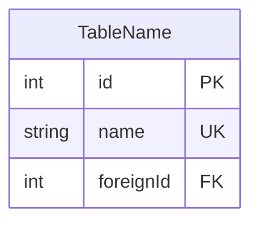

# BSF 03 — Database Design

## Purpose
ตอบ: "ข้อมูลเก็บยังไง ตารางอะไร เชื่อมกันยังไง"

## Dependencies
- 01 (DFD — Data Stores D1-D3)
- 02 (Screen data — แต่ละ SCR ใช้ข้อมูลอะไร)

## Actions

1. **ER Diagram** — Mermaid erDiagram: ทุก table + relations + cardinality
2. **Table Cards** — grid: แต่ละการ์ด = 1 ตาราง, บอก PK, FK, purpose, SCR ที่ใช้
3. **Index Strategy** — index ตาม query pattern (status+eta, poNumber)
4. **Audit Trail** — AuditLog table: tableName, recordId, action, oldValue, newValue

## Mermaid ERD Syntax (Critical)


**ห้ามใช้ single-line:** `Table { int id PK string name }` — จะ render ไม่ขึ้น

## Output

| Blueprint | Companion |
|-----------|-----------|
| HTML: ER Diagram (diagram-box) + ตาราง cards | `schema.prisma` |

## schema.prisma Example
```prisma
model ShipmentMaster {
  containerNo   String   @id
  status        String   @default("DRAFT")
  supplierId    Int
  supplier      Supplier @relation(fields: [supplierId], references: [id])
  items         ShipmentItem[]
  
  @@index([status, eta])
}
```

## Narrative Bridge → 04
"เมื่อข้อมูลมีที่เก็บ — API คือสะพานเชื่อม UI กับ Database"
