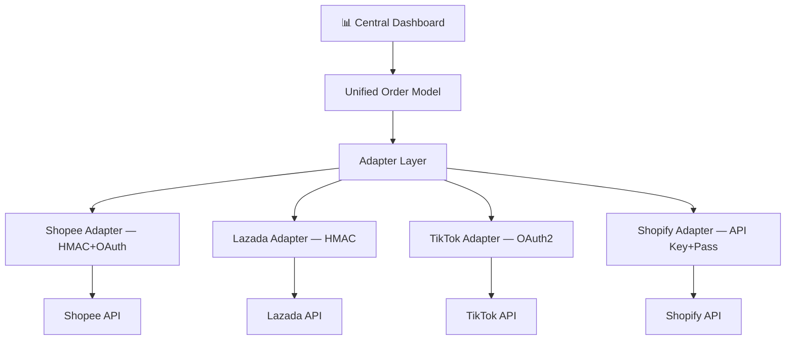

# E-Commerce Platform APIs — Integration Research

Researched during ECIH Phase 1 (Shopee pilot), 2026-06-05.
Source: GitHub real implementations (official docs are SPAs that don't render for scraping).

## Research Methodology for SPA-Only API Docs

When official API docs are JavaScript SPAs (Shopee, Lazada, TikTok) that don't render content for scraping/browsing:
1. **Search GitHub** for SDKs, exporters, and integrations — `shopee open platform api order python` etc.
2. **Read source code** — real implementations contain working API calls with actual endpoints, params, and response handling
3. **Cross-reference npm/pip registries** for SDK packages and their source repos
4. **Ignore official docs crawlers** — curl/browser return empty SPA shells

---

## Shopee Open API v2 (PILOT)

### Base URLs
| Environment | URL |
|------------|-----|
| Sandbox | `https://partner.test-stable.shopeemobile.com` |
| Production | `https://partner.shopeemobile.com` |

### Authentication — HMAC-SHA256 Signature

**Auth endpoints** (no shop context):
```
base_string = partner_id + api_path + timestamp
signature = HMAC-SHA256(partner_key, base_string) → hex output
```

**Shop-level endpoints**:
```
base_string = partner_id + api_path + timestamp + access_token + shop_id
signature = HMAC-SHA256(partner_key, base_string) → hex output
```

All params sent as query string: `?partner_id=...&timestamp=...&sign=...&shop_id=...&access_token=...`

### OAuth Flow

```
Step 1: Build auth URL
  GET /api/v2/shop/auth_partner
  Params: partner_id, timestamp, sign, redirect (URL)

Step 2: Redirect shop owner to that URL → they authorize

Step 3: Callback to redirect URL → receive authorization code

Step 4: Exchange code for token
  POST /api/v2/auth/token/get
  Body: { "code": "...", "shop_id": 123, "partner_id": 456 }
  Response: { "access_token": "...", "refresh_token": "...", "shop_id": 123 }
```

### API Key Sources (Seller Center)
| Key | How to get |
|-----|-----------|
| `partner_id` | Seller Center → Open Platform → Create App |
| `partner_key` | Seller Center → Open Platform → App credentials |
| `shop_id` | Returned in OAuth callback after shop owner authorizes |
| `access_token` | OAuth token exchange (step 4 above) |
| `refresh_token` | OAuth token exchange — use to get new access_token |

### Order Endpoints

**Get Order List:**
```
GET /api/v2/order/get_order_list
Params:
  partner_id, timestamp, sign, shop_id, access_token
  time_range_field = "create_time"
  time_from, time_to            (Unix timestamp, seconds)
  page_size = 100               (max per page)
  cursor                        (pagination cursor)
  response_optional_fields = "order_status"

Response:
{
  "response": {
    "order_list": [{ order_sn, order_status, create_time, update_time, ... }],
    "more": true/false,
    "next_cursor": ""
  }
}
```

**Get Order Detail:**
```
GET /api/v2/order/get_order_detail
Params:
  partner_id, timestamp, sign, shop_id, access_token
  order_sn_list = "SN1,SN2,SN3"    (comma-separated, max 50)
  response_optional_fields = "buyer_username,total_amount,shipping_carrier,..."

Response:
{
  "response": {
    "order_list": [{ full order objects with requested fields }]
  }
}
```

### Available Order Fields (response_optional_fields)

| Category | Fields |
|----------|--------|
| Identity | `order_sn`, `order_status` |
| Timeline | `create_time`, `update_time`, `pay_time` |
| Buyer | `buyer_user_id`, `buyer_username` |
| Shipping | `shipping_carrier`, `recipient_address`, `estimated_shipping_fee`, `actual_shipping_fee`, `actual_shipping_fee_confirmed`, `order_chargeable_weight_gram` |
| Payment | `payment_method`, `total_amount`, `currency`, `credit_card_number` |
| Items | `package_list`, `goods_to_declare` |
| Fulfillment | `fulfillment_flag`, `pickup_done_time` |
| Cancel | `cancel_reason`, `cancel_by`, `buyer_cancel_reason` |
| Notes | `note`, `note_update_time` |
| Invoice | `invoice_data` |
| Other | `dropshipper`, `dropshipper_phone`, `split_up`, `buyer_cpf_id` |

### Pagination
- Cursor-based (not offset)
- page_size max = 100
- Response includes `more` (boolean) + `next_cursor` (string)

### Rate Limits

Shopee official limit: **~1,000 requests/hour per app**.

#### Practical Calculation

| Scenario | Records | Calls (page_size=100) | % of Limit | Est. Time |
|----------|---------|----------------------|------------|-----------|
| Light day | 2,000 | 20 | 2% | ~10s |
| Normal day | 20,000 | 200 | 20% | ~1.5 min |
| Heavy day | 100,000 | 1,000 | 100% | ~8 min |

Formula: `records ÷ 100 = calls`, each call ~500ms latency.

Note: Cursor-based pagination means pages must be fetched sequentially (can't parallelize). Rate limit is per app, not per shop. `get_order_list` provides enough data for daily sales reports — `get_order_detail` only needed for item-level breakdown.

#### Exceeding 1,000/hr

If daily volume exceeds 100,000 records:
- Split fetch across hours (batch mode)
- Use `get_order_list` only (skip detail) — reduces calls significantly
- Multiple app registrations (one per env: sandbox + production separate limits)

Pagination with small delay (100-200ms) between pages is safe and avoids rate limit issues entirely.

---

## Platform Comparison Matrix

| | Shopee | Lazada | TikTok Shop | Shopify |
|---|---|---|---|---|
| **Auth Type** | HMAC-SHA256 + OAuth | HMAC-SHA256 | OAuth 2.0 | API Key + Password |
| **Key Source** | Seller Center | Lazada Seller Center | TikTok Seller Center | Shopify Admin |
| **Signature** | `partner_id+path+ts+token+shop_id` | `app_key+api_name+params+ts` | Bearer token | Basic Auth header |
| **Order List** | `GET /order/get_order_list` | `GET /order/orders/get` | `POST /api/orders/search` | GraphQL `orders` query |
| **Order Detail** | `GET /order/get_order_detail` | `GET /order/order/get` | `GET /api/orders/detail` | GraphQL `order` query |
| **Pagination** | Cursor | Offset-based | Cursor | Cursor (GraphQL) |
| **Batch Size** | 100 orders/page | 100 orders/page | 50 orders/page | 250 items/query |
| **Sandbox** | ✅ Yes | ✅ Yes | ✅ Yes | ✅ Yes (dev store) |
| **SDKs Available** | PHP, Node, Python, TS | PHP, Node, Java | Python, Node | Python, Node, Ruby, PHP |
| **Data Format** | JSON | JSON | JSON | JSON (GraphQL) |
| **Rate Limit Pattern** | ~1000 req/hr/app | ~5000 req/day | ~200 req/min/app | 2 req/sec (REST), 50 pts/sec (GraphQL) |

## Offline-Sale Platforms (Portal/Scrape Type)

| Platform | Source | Method | Key Challenge |
|----------|--------|--------|---------------|
| Homepro | Supplier Portal | Web scrape / session login | Password rotation every 3 months |
| CRC | Supplier Portal | Web scrape / session login | Same password issue |
| GoWholesale | Web Portal | Scrape | May have CSV export |
| BigC | Supplier Portal | Scrape / Excel download | Format changes frequently |
| Makro | Supplier Portal | Scrape / PDF download | PDF text conversion errors |

These require **Portal Adapter** type — browser automation (Playwright) + file parsing (PDF/Excel), not REST API.
See `integration-hub-adapter-pattern.md` for the dual-type architecture.

---

## Implementation Reference

Source code reference (TypeScript, working Shopee API v2 implementation):
- GitHub: `earlwlkr/shopee-exporter` — `src/lib/shopee.ts` (auth + signature), `src/app/api/export/route.ts` (order list + detail + CSV export)
- npm: `shopee-api` (Node.js wrapper), `shopee-api-client` (TypeScript client)

## Related

- `integration-hub-adapter-pattern.md` — Dual-type adapter architecture
- `epicor-dmt-integration.md` — DMT-first transport for Epicor ERP
- ECommerceIntegrationHub: `/mnt/c/Users/tikawutw/hermes-jung-sa/ECommerceIntegrationHub/`

---

## Architecture: Adapter Pattern + Unified Order Model

Designed during ECIH restart Discovery session, 2026-06-09.

### Central Hub Architecture



### Adapter Responsibilities (3 per platform)

1. **Auth** — handle signature/OAuth/token refresh for that platform
2. **Fetch** — call API endpoints + pagination + rate limit handling
3. **Normalize** — transform platform response → Unified Order Model

### Unified Order Model (Prisma)

```prisma
model Platform {
  id        String   @id
  name      String   // SHOPEE | LAZADA | TIKTOK | SHOPIFY
  authType  String   // HMAC_OAUTH | HMAC_SHA256 | OAUTH2 | API_KEY
  config    Json     // { apiKey, secret, shopId, ... }
  isActive  Boolean
  orders    Order[]
}

model Order {
  id            String   @id
  platformId    String
  platform      Platform @relation(fields: [platformId])
  
  externalId    String   // order_sn / order_number from platform
  status        String   // normalized: PENDING|CONFIRMED|SHIPPED|DELIVERED|CANCELLED
  totalAmount   Float
  currency      String
  
  buyerName     String?
  shippingAddr  String?
  createdAt     DateTime
  updatedAt     DateTime
  
  rawData       Json     // full platform response for platform-specific queries
  items         OrderItem[]
}

model OrderItem {
  id          String  @id
  orderId     String
  order       Order   @relation(fields: [orderId])
  productName String
  sku         String?
  quantity    Int
  unitPrice   Float
}
```

### MVP Scope (Pilot)

- Shopee only first
- Daily order/sales pull
- Dashboard display
- CSV export button
- Phase 2+: add Lazada, TikTok, Shopify adapters

### Tech Stack

| Layer | Tech | Reason |
|-------|------|--------|
| Dashboard | React + Vite | Consistent with other projects |
| Backend | Express + Prisma | Lightweight, single ORM |
| DB | PostgreSQL (Supabase) | Free tier, already in use |
| Jobs | node-cron | Scheduled daily fetch |
| Auth | API keys stored in DB (encrypted) | No nested OAuth needed |
